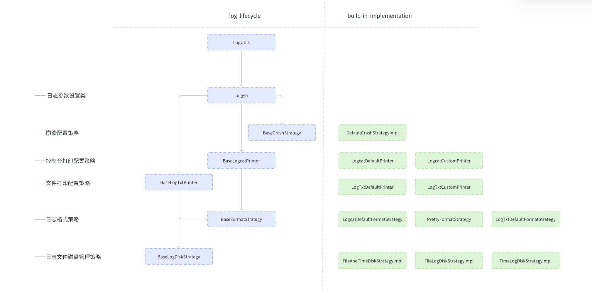
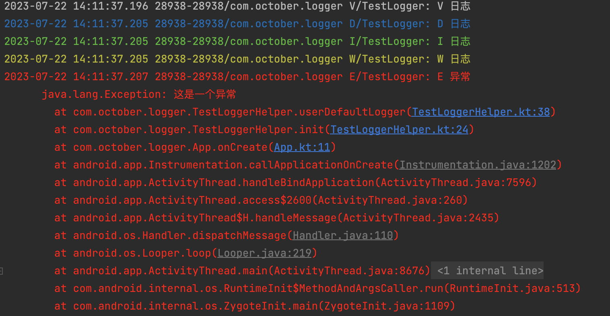
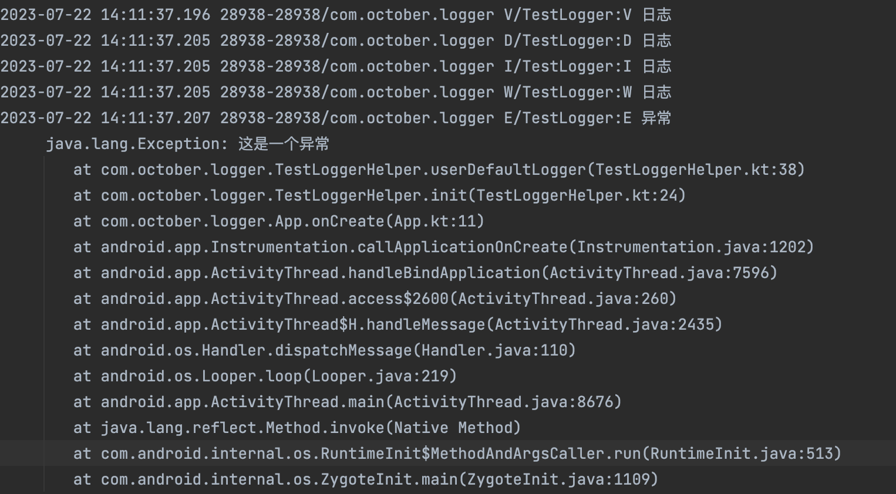
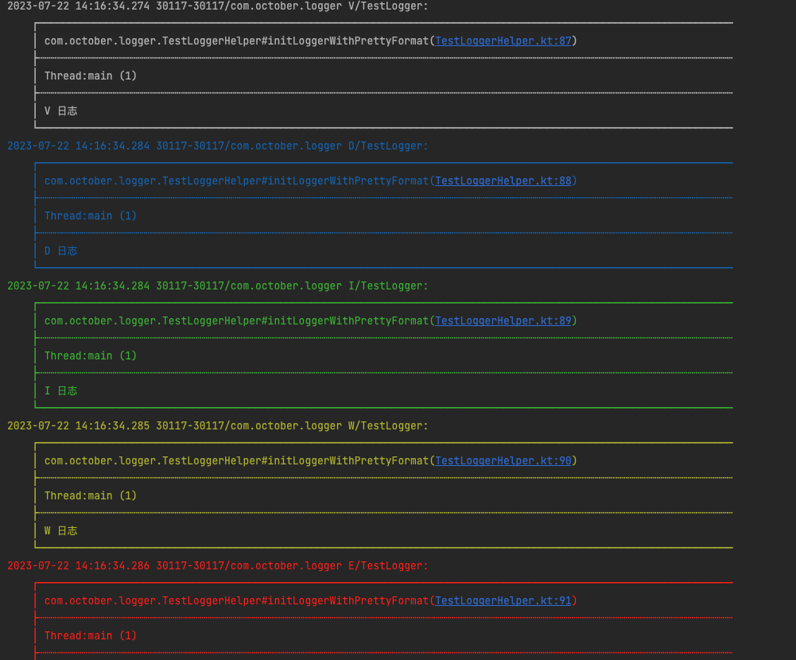

# 说明文档

## 说明
 Android日志库，官方Log 高替版。允许同时把日志 **输出到Logcat **和 **保存到本地**。因其内部实现采用策略的设计模式，所以使用者可以根据自己的需求轻松定制该库的每个模块，包括日志输出格式、日志保存方式、异常捕获方式等。

## 使用说明

#### 添加依赖

在 root/build.gradle 中添加

```
repositories {
     maven { url 'https://jitpack.io' }
}
```

在项目中添加依赖

```
implementation ''
```

#### 使用 QLlogger

```
//初始化 OTLogger
val logger = Logger.Builder()
            .setCrashStrategy(DefaultCrashStrategyImpl(app)) //设置捕获策略，捕获到的异常正常输出到日志文件中
            .build()
LogUtils.setLogger(logger)

//使用 QLlogger
LogUtils.v(TAG, "V级别 日志")  
LogUtils.d(TAG, "D级别 日志") 
LogUtils.i(TAG, "I级别 日志")  
LogUtils.w(TAG, "W级别 日志")  
LogUtils.e(TAG, "E级别 日志")  
```

- 默认Logger 打印日志到 Logcat的同时会保存日志到 storage/emulated/0/Android/data/packageName/files/log 下；
- 默认Logger 会把日志按与Log一致的格式输出到控制台和日志文件，并且日志文件仅仅保留7天，超过时间的日志文件自动删除。

```
1970-01-01 08:42:37.224 6492-6492/com.october.logger V/TestLogger: V 日志
1970-01-01 08:42:37.227 6492-6492/com.october.logger D/TestLogger: D 日志
1970-01-01 08:42:37.227 6492-6492/com.october.logger I/TestLogger: I 日志
1970-01-01 08:42:37.227 6492-6492/com.october.logger W/TestLogger: W 日志
1970-01-01 08:42:37.228 6492-6492/com.october.logger E/TestLogger: E 异常  
      java.lang.Exception: 这是一个异常
        at com.october.logger.TestLoggerHelper.userDefaultLogger(TestLoggerHelper.kt:32)
        at com.october.logger.TestLoggerHelper.init(TestLoggerHelper.kt:24)
        at com.october.logger.App.onCreate(App.kt:11)
        at android.app.Instrumentation.callApplicationOnCreate(Instrumentation.java:1119)
        at android.app.ActivityThread.handleBindApplication(ActivityThread.java:5740)
        at android.app.ActivityThread.-wrap1(Unknown Source:0)
        at android.app.ActivityThread$H.handleMessage(ActivityThread.java:1656)
        at android.os.Handler.dispatchMessage(Handler.java:106)
        at android.os.Looper.loop(Looper.java:164)
        at android.app.ActivityThread.main(ActivityThread.java:6494)
        at java.lang.reflect.Method.invoke(Native Method)
        at com.android.internal.os.RuntimeInit$MethodAndArgsCaller.run(RuntimeInit.java:438)
        at com.android.internal.os.ZygoteInit.main(ZygoteInit.java:807)
```

如果希望定制日志输出格式、日志输出级别、日志保存文件夹地址，见**高级功能**。


## lib_logger 设计模型



## 高级功能

**几乎所有的日志行为都可以通过定制一个Logger来实现。**

如果不想用默认的方式，可以自定义一个Logger 以便控制 Logcat 和 日志文件 的输出格式，如下:

```kotlin
//定制一个Logger
 val logger = Logger.Builder()
         .setLogcatPrinter(LogcatDefaultPrinter()) //设置Logcat Printer
         .setLogTxtPrinter(LogTxtDefaultPrinter()) //设置LogTxt Printer
         .build()
//设置使用该Logger
LogUtils.setLogger(logger)
```

### 配置Logcat打印机

所有输出到Logcat的打印机都必须继承`BaseLogcatPrinter`, 目前已经实现Locat 打印机：

- LogcatDefaultPrinter:  默认Locat打印机，输出日志格式和 Log 一致
- LogcatCustomPrinter: 自定义Locat打印机，可以自行配置是否打印到Locat , 最大输出日志等级，日志格式(`BaseFormatStrategy`)等。

```kotlin
val logger = Logger.Builder()
            .setLogcatPrinter( //设置Logcat Printer
                LogcatCustomPrinter(
                             true           //是否打印日志到 Logcat
                            ,LogLevel.V     //最低输出日志级别
                            ,LogcatDefaultFormatStrategy() //日志格式
                )
            )
            .build()
//设置使用该Logger
LogUtils.setLogger(logger)
```

### 配置日志文件打印机

所有输出到日志文件的打印机都必须继承 `BaseLogTxtPrinter`，目前已实现的日志文件打印机：

- LogTxtDefaultPrinter：默认日志文件打印机，输出日志格式和Log一致，使用日志文件管理策略(`TimeLogDiskStrategyImpl`),按小时创建日志文件, 超过7天的日志自动删除;

- LogTxtCustomPrinter：自定义日志文件打印机，可以自行配置是否打印到Logcat，最大输出日志等级，日志格式，文件管理策略。

  

  ``` kotlin
  //定制一个Logger
  val logger2 = Logger.Builder()
        .setLogTxtPrinter(
             LogTxtCustomPrinter(
      								true    												//是否打印到日志文件
      								,LogLevel.V      		       			//最低打印日志级别
      								,LogTxtDefaultFormatStrategy()  //日志格式
      								,TimeLogDiskStrategyImpl()      //日志文件管理策略
    				)	
  			).build()
  //设置使用该Logger
  LogUtils.setLogger(logger)
  ```

  

### 日志格式策略

每一个自定义打印机可以选择自己的日志格式，所有的日志格式都是继承`BaseFormatStrategy`实现的。默认已经实现的日志格式：	

- LogcatDefaultFormatStrategy：默认Logcat 日志输出格式；

  

- LogTxtDefaultFormatStrategy:默认日志文件输出格式；

  

- PrettyFormatStrategy : 漂亮的日志输出格式（仅仅合适Logcat , 不建议在日志文件中使用）
- 

### 日志文件管理策略

日志写入到本地磁盘中，不能一直不管，必须需要一套文件管理机制去管理写入到磁盘的日志文件，避免日志过多或者日志混乱现象发生。

每个日志管理策略都需要继承`BaseLogDiskStrategy` ，已实现的日志管理策略有：

- TimeLogDiskStrategyImpl：按时间管理日志文件
  - 默认按照小时创建日志文件
  - 默认每个日志文件保存七天
  - 默认文件名:  log\_年\_月\_日\_时间段.log 。eg：log_2023_02_12_15_16.log ，这里的 15_16 表示该文件储存 15点到16点的日志。

- FileLogDiskStrategyImpl：按存储管理日志文件
  -  默认每个日志文件5MB，参考[getLogFileMaxSizeOfMB]
  -  默认日志文件夹最大可容纳 100M日志，超过[getLogDirMaxStoreOfMB]会按照时间顺序删除旧的日志，直到低于预定值
  -  默认文件名 log_年_月_日_时_分_秒.log 。 eg: log_2023_02_12_16_28_56.log

-  FileAndTimeDiskStrategyImpl ：文件+时间管理策略，同时具备[FileLogDiskStrategyImpl] 和 [TimeLogDiskStrategyImpl] 的特性
  -  默认日志文件夹最大可容纳 100M日志，超过[getLogDirMaxStoreOfMB]会按照时间顺序删除旧的日志，直到低于预定值。
  -  默认文件名 默认文件名 log_年_月_日_时间段_创建时间戳.log 。eg: log_2023_02_12_16_17_1233644846.log

```kotlin
//我的日志管理策略
val fileAndTimeDiskStrategyImpl = object : FileAndTimeDiskStrategyImpl() {
  override fun getLogDir(): String {
    return super.getLogDir()  //我的日志文件夹
  }

  override fun getMinFreeStoreOfMB(): Long {
    return 100  //设置系统必须至少还有100MB才能继续创建日志文件
  }

  override fun getLogDirMaxStoreOfMB(): Long {
    return 200  //设置日志文件夹最多容纳多少MB的日志
  }

  override fun getSegment(): BaseTimeLogDiskStrategy.LogTimeSegment {
    return BaseTimeLogDiskStrategy.LogTimeSegment.ONE_HOUR //设置每次间隔一个小时创建一个日志文件
  }

  override fun getLogFileMaxSizeOfMB(): Long {
    return 10  //设置每个日志文件最大是 10M ,超过10M自动创建下一个日志文件
  }

}

/*val timeDiskStrategyImpl = object :TimeLogDiskStrategyImpl(){
            override fun getLogDir(): String {
                return super.getLogDir()  //我的日志文件夹
            }

            override fun getSegment(): LogTimeSegment {
                return BaseTimeLogDiskStrategy.LogTimeSegment.THREE_HOURS //设置每次间隔2个小时创建一个日志文件
            }
        }*/

/*val fileDiskStrategyImpl = object :FileLogDiskStrategyImpl(){
            override fun getLogDir(): String {
                return super.getLogDir()  //我的日志文件夹
            }

            override fun getLogFileMaxSizeOfMB(): Long {
                return 10  //设置每个日志文件最大是 10M ,超过10M自动创建下一个日志文件
            }

            override fun getMinFreeStoreOfMB(): Long {
                return 100  //设置系统必须至少还有100MB才能继续创建日志文件
            }

            override fun getLogDirMaxStoreOfMB(): Long {
                return 200  //设置日志文件夹最多容纳多少MB的日志
            }
        }*/


val logger = Logger.Builder()
	   .setLogTxtPrinter(
  			LogTxtCustomPrinter(//设置默认的LogTxt Printer
    				true, LogLevel.V, LogTxtDefaultFormatStrategy()
    				, fileAndTimeDiskStrategyImpl
  			)
		).build()
```

### 异常捕获策略

如果你希望发生异常的时候，把异常信息写入到日志文件方便定位。那么你可以配置异常捕获策略，默认异常捕获策略是空的，需要使用者自行配置。

```kotlin
val logger = Logger.Builder()
		.setCrashStrategy(DefaultCrashStrategyImpl(app))//配置异常捕获策略
		.build()
LogUtils.setLogger(logger)
```

  

### 拓展

以上所有的策略囊括了日志打印的所有逻辑，如果你发现上面的策略不合适你的项目，你可以继承并重写该策略。
